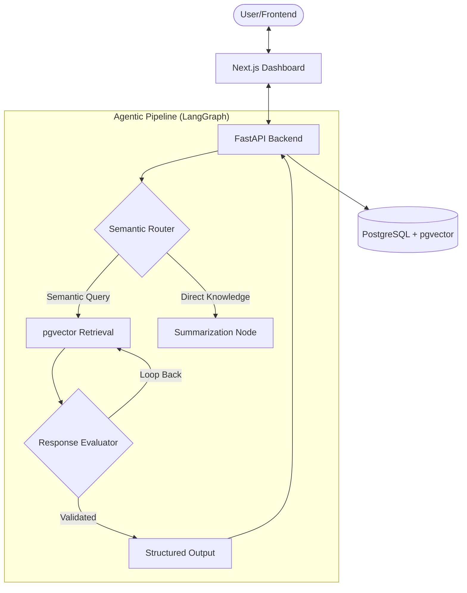

# NexusBase: Enterprise RAG Architecture

[](https://nextjs.org/)
[](https://fastapi.tiangolo.com/)
[](https://python.langchain.com/docs/langgraph/)
[](https://github.com/pgvector/pgvector)

**NexusBase** is a production-grade Retrieval-Augmented Generation (RAG) system designed for enterprise-scale knowledge management. It leverages a modern agentic workflow using LangGraph to handle complex document reasoning, multi-step retrieval, and structured responses.

## 🏗️ Architecture

The system follows a modular, containerized architecture designed for high availability and low latency.



## 🚀 Quick Start (Local Deployment)

NexusBase is fully containerized with Docker. To spin up the entire stack (Dashboard, API, Database, and Workers), run the following command:

### Prerequisites
- Docker & Docker Compose
- OpenAI API Key (or local LLM configuration in `.env`)

### Deployment
```bash
# Clone the repository (if not already local)
# git clone <your-repo-url>
# cd NexusBase

# Initialize environment variables
cp .env.example .env

# Launch the stack
docker compose up --build
```

The services will be available at:
- **Dashboard:** `http://localhost:3000`
- **Backend API:** `http://localhost:8000`
- **Database:** `localhost:5432`

## 🛠️ Tech Stack

- **Frontend:** Next.js 14, TypeScript, Tailwind CSS, Lucide React.
- **Backend:** Python 3.11, FastAPI, Pydantic.
- **Orchestration:** LangGraph, LangChain.
- **Vector Store:** PostgreSQL with `pgvector` extension.
- **DevOps:** Docker, Docker Compose, GitHub Actions.

## 📄 License
This project is licensed under the MIT License.
